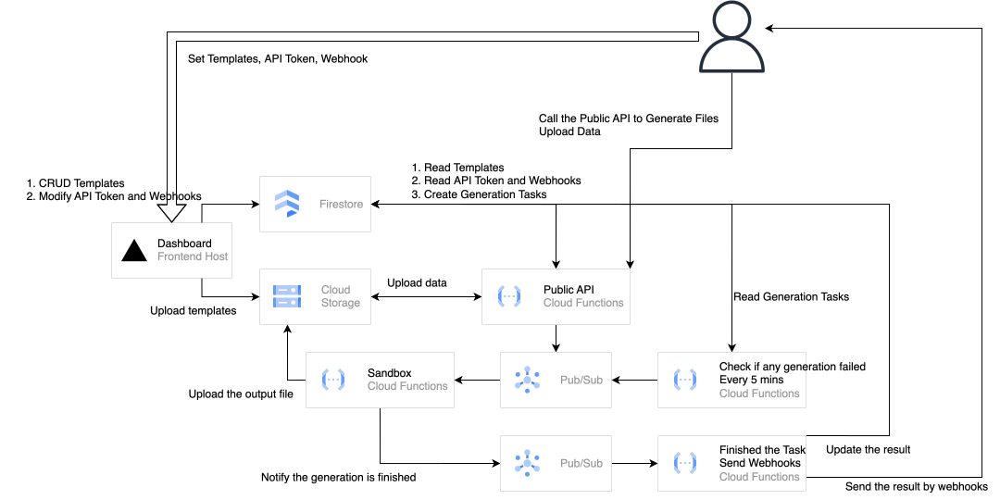

# Easy File Gen

A prototype file-generation service that separates template execution from the main application and provides reusable APIs for generating files.

**Live Demo:** https://easy-file-gen-dashboard.vercel.app/

**Detailed Case Study:** https://easy-file-gen-dashboard.vercel.app/about

## Why I Built This

Many applications need to generate reports, PDFs, or other files even when file generation is not part of their core business.

Keeping this logic inside the main application can create two problems:

* File generation may consume significant CPU and memory and affect normal application workloads.
* Different file types require different data, templates, formats, and libraries, which can increase code complexity over time.

I built Easy File Gen to explore whether this workload could be separated into an independent and reusable service.

## Features

The prototype includes:

* Template management
* Public file-generation API
* Webhook configuration
* Authentication
* Sandboxed template execution
* API documentation
* Browser-based template editing

## Architecture

The service separates template management, API handling, and template execution.



One important part of the design is the sandbox layer.

Instead of coupling the system to one template engine or runtime, template execution is isolated from the main application. This also creates a path for supporting different languages, runtime versions, or file-generation libraries.

The current architecture is designed as a SaaS prototype. An internal version could be significantly simpler by reusing existing authentication, infrastructure, and trusted execution environments.

For a more detailed discussion of the architecture and trade-offs, see the [case study](https://easy-file-gen-dashboard.vercel.app/about).

## Tech Stack

### Frontend

* TypeScript
* SolidJS / SolidStart
* Tailwind CSS
* Monaco Editor
* Swagger UI
* Vercel

### Backend & Infrastructure

* Firebase
* Firestore
* Google Cloud Platform
* Cloud Functions
* Sandboxed Node.js execution

## Design Considerations

### Resource Isolation

File generation can be CPU- or memory-intensive.

Separating the workload allows it to be scaled independently instead of increasing the resources of the main application only to support occasional generation jobs.

### Template Execution

Different file types may use different templates and generation libraries.

The sandbox provides an execution boundary between the main service and template code and makes it possible to support additional runtimes in the future.

### SaaS vs. Internal Service

A public SaaS requires additional components such as authentication, template management, execution isolation, and user-facing configuration.

An internal implementation could remove many of these components and rely on existing company infrastructure.

This project helped me explore how the same technical problem can lead to very different architectures depending on the environment and requirements.

## Local Development

Requires Node.js 20 or later.

```bash
npm install
npm run dev
```

Build the application:

```bash
npm run build
```

Run the production build:

```bash
npm start
```

## Project Status

Easy File Gen is a prototype built to explore file-generation architecture, workload isolation, template management, and sandboxed execution.

It is not intended to be a production-ready file-generation platform.
